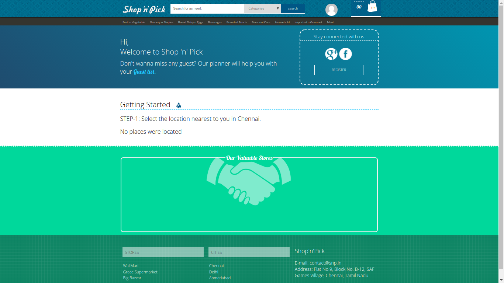
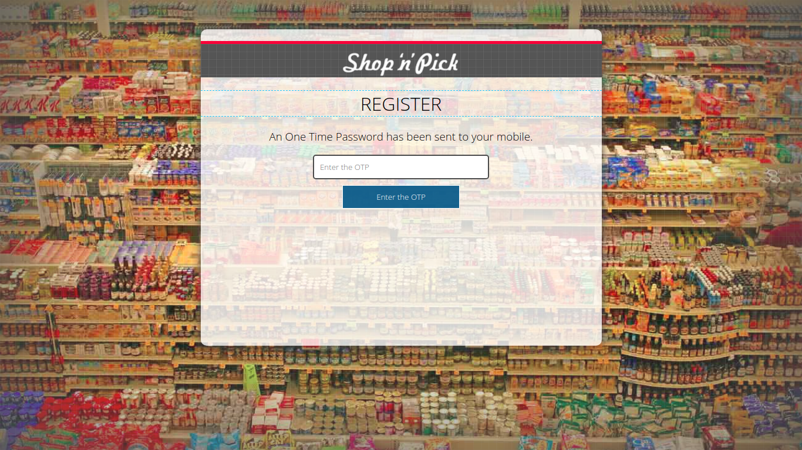

# Shop-n-pick

Live Site [Shop-n-pick](http://snpuser.pe.hu/)

|              Home Page                 |           Registeration                |
| :------------------------------------: | :------------------------------------: |
|                   |               |


## Development

The app was built with xampp.(https://www.apachefriends.org/download.html).

### Running the application

Fork, then clone the `Shop-n-pick` repo and change directory into it.

```
git clone https://github.com/tarunsai284/Shop-n-pick.git
cd Shop-n-pick
```

Linux Install : Download the run file, navigate to /opt/lampp and run manager-linux-x64.run. Under the "Manage Server" tab opened in gui Start All services.

```
wget https://www.apachefriends.org/xampp-files/7.2.8/xampp-linux-x64-7.2.8-0-installer.run
sudo chmod +x ./xampp-linux-x64-7.2.8-0-installer.run
sudo ./xampp-linux-x64-7.2.8-0-installer.run

sudo /opt/lampp/run manager-linux-x64.run
```

Configure Apache Web Server and change the port number to 8000 or something suitable Make sure you have the web serever running on http://localhost:8000.If you don't have it running locally, then tunnel to the correct host and port. Navigate to "phpMyAdmin" tab on the localhost page and create a new DataBase and import the zip u611746397_snp.sql.gz from git repositry cloned and you have succesfully setup your backend database.

```
cd copyPhpFiles/
cp /public_html /opt/lampp/htdocs
```

#### Commands

| Command                        | Description                       |
| ------------------------------ | --------------------------------- |
| `/opt/lampp/lampp/start`       | Starts XAMPP.                     |
| `/opt/lampp/lampp stop`        | Stops XAMPP.                      |
| `/opt/lampp/lampp restart`     | Stops and starts XAMPP.           |
| `/opt/lampp/lampp startapache` | Starts only the Apache.           |
| `/opt/lampp/lampp stopapache`  | Stops the Apache.                 |
| `/opt/lampp/lampp startmysql`  | Starts only the MySQL database.   |
| `/opt/lampp/lampp stopmysql`   | Stops the MySQL database.         |
| `/opt/lampp/lampp startftp`    | Starts the ProFTPD server.        |
| `/opt/lampp/lampp stopapache`  | Stops the Apache.                 |
| `/opt/lampp/lampp stopapache`  | Stops the ProFTPD server.         |
